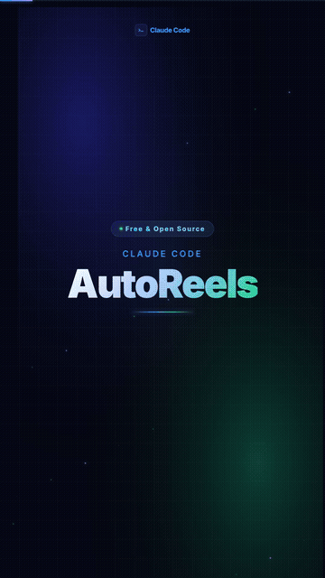

# AutoReels

<p align="center">
  
</p>

<p align="center">
  <strong>Turn any topic into a professional Instagram Reel — automatically.</strong><br/>
  Animated scenes · Voice cloning · Ready-to-post 1080×1920 MP4
</p>

<p align="center">
  <a href="https://github.com/neeraj10raja/Claude-code-reels/blob/main/out/autoreels-reel.mp4">▶ Watch full demo reel</a> &nbsp;·&nbsp;
  
  &nbsp;·&nbsp;
  
  &nbsp;·&nbsp;
  
</p>

---

> Built with [Remotion](https://remotion.dev) + [Chatterbox TTS](https://github.com/resemble-ai/chatterbox). Completely free to run.

**Time to first render:** ~5 minutes (`git clone` + `npm install` + render — no Python needed to start)
**Time to use your own voice:** ~20 minutes extra (Python setup + 1.5 GB model download, one-time only)

---

## What it generates

A 33-second vertical reel (1080×1920 · 30fps · ~7 MB) with 5 animated scenes:

| Scene | Duration | Content |
|-------|----------|---------|
| 1 — Title card | 5s | Feature name animates in word-by-word + Claude Code logo |
| 2 — What it does | 6s | 4 bullet points slide in with staggered spring animation |
| 3 — Terminal demo | 10s | Live terminal showing Claude running the feature step by step |
| 4 — Before / After | 6.5s | Side-by-side comparison cards + animated metric counter |
| 5 — Follow CTA | 5.5s | Your Instagram handle + Anthropic badge |

**Visual polish:** Google Inter font · animated gradient mesh background · floating particles · smooth slide transitions · progress bar · Claude Code + Anthropic SVG logos throughout

---

## Quickstart — interactive wizard

The fastest way to get started:

```bash
git clone https://github.com/YOUR_USERNAME/claude-code-reels
cd claude-code-reels
npm install
python3 scripts/setup.py
```

The wizard walks you through everything — API key, voice recording, picking a topic, and rendering — step by step. **No flags to memorise.**

---

## Manual walkthrough (advanced)

For those who prefer explicit commands over the wizard.

### Step 1 — Clone and install

```bash
git clone https://github.com/YOUR_USERNAME/claude-code-reels
cd claude-code-reels
npm install
```

Requires **Node.js 18+**. Check with `node --version`.

---

### Step 2 — Set up Python for voice cloning

```bash
python3 -m venv .venv
source .venv/bin/activate       # macOS / Linux
# .venv\Scripts\activate        # Windows

pip install -r scripts/requirements.txt
```

> The first time you run voice generation it downloads **~1.5 GB** of Chatterbox model weights. This is a one-time download — cached in `~/.cache/` after that.

---

### Step 3 — Record your 30-second voice clone

This is the most important step. A good 30-second recording makes the cloned voice sound nearly identical to you. A bad recording sounds robotic.

#### What to record

Read this script out loud — naturally, at your normal speaking pace:

> *"Hey everyone, welcome back. Today I want to show you something really cool I've been working on. Claude Code has been getting a lot of new features lately and I think this one is going to save you a lot of time. Let me walk you through exactly how it works and why it matters for your daily workflow. If you're the kind of developer who's always looking for ways to move faster without sacrificing quality, then stick around — this one's for you."*

That's about 30 seconds. You don't need to say this exact text in your reels — it's just a reference sample so the AI can learn your voice.

#### Recording tips

| Do | Don't |
|----|-------|
| Sit in a quiet room | Record near a fan, AC, or open window |
| Speak 5–10 cm from the mic | Hold the phone at arm's length |
| Use a normal, conversational tone | Whisper or shout |
| Record one continuous take | Start and stop repeatedly |
| Use your phone mic if it's good | Use a laptop mic with fan noise |

#### How to record on Mac

1. Open **QuickTime Player**
2. File → New Audio Recording
3. Click the dropdown arrow next to the record button → pick your best mic
4. Click record, read the script, click stop
5. File → Export As → save as `my-voice.m4a`
6. Move it to `public/my-voice.m4a`

#### How to record on iPhone

1. Open the **Voice Memos** app
2. Tap the red button, read the script, tap stop
3. Tap the recording → tap `...` → Share → AirDrop to your Mac
4. Move it to `public/my-voice.m4a`

#### How to record on Windows

1. Open **Voice Recorder** (search in Start menu)
2. Click the mic button, read the script, click stop
3. Find the file in `Documents\Sound recordings\`
4. Move it to `public/my-voice.m4a` (WAV format also works)

#### Check your recording quality

Play it back and confirm:
- [ ] No echo or reverb
- [ ] No background hum, fan noise, or music
- [ ] Your voice is clear and at consistent volume throughout
- [ ] It's at least 20 seconds long (30 is ideal)

---

### Step 4 — Generate your voice narration

```bash
# Use the included sample voice (works immediately, no recording needed)
python3 scripts/generate_voice.py --feature hooks

# Use your own voice recording
python3 scripts/generate_voice.py --feature hooks --ref public/my-voice.m4a

# Write a custom narration instead of the built-in script
python3 scripts/generate_voice.py --feature hooks --ref public/my-voice.m4a \
  --script "Claude Code just shipped Hooks — here's why it changes everything..."

# See all built-in feature scripts
python3 scripts/generate_voice.py --list
```

Output is saved to `public/hooks-voice.m4a`.

Generation takes **1–3 minutes** on CPU, ~30 seconds on Apple Silicon (MPS), ~20 seconds on NVIDIA GPU.

---

### Step 5 — Edit `config.ts` for your feature

Open `src/ClaudeCodeReel/config.ts`. This is the **only file you change** between posts:

```ts
export const FEATURE = {
  badge: "Claude Code · New Feature",
  title: "Hooks",                              // shown large on title card
  subtitle: "Auto-run shell commands\non every Claude action",
  audioFile: "hooks-voice.m4a",               // ← must match what generate_voice.py produced

  bullets: [                                   // Scene 2 — 4 bullets max
    { icon: "⚡", text: "Fire before/after any tool use" },
    { icon: "🎨", text: "Auto-format on every file edit" },
    { icon: "🛡️", text: "Block dangerous commands" },
    { icon: "🔗", text: "Pipe Claude into your workflow" },
  ],

  terminal: {                                  // Scene 3 — tool calls to animate
    userMessage: "Edit app.ts and add error handling",
    steps: [
      { tool: "Read",    input: "src/app.ts", output: "142 lines captured", color: "#2997FF", delay: 55, duration: 28, isHook: false },
      { tool: "Edit",    input: "src/app.ts", output: "Added try/catch blocks", color: "#2997FF", delay: 95, duration: 30, isHook: false },
      { tool: "↳ HOOK",  input: "PostToolUse · prettier src/app.ts", output: "✓ Formatted · 180ms", color: "#34d399", delay: 138, duration: 22, isHook: true },
    ],
    summary: "✓ Edited + auto-formatted. Zero manual steps.",
    summaryFrame: 252,
  },

  impact: {                                    // Scene 4 — before/after
    before: { value: "Manual", detail: "Run formatter after every edit" },
    after:  { value: "Auto",   detail: "Hooks fire automatically" },
    metric: "0", metricSuffix: " manual steps", metricLabel: "per session",
  },

  cta: {
    handle: "@your.handle",                    // ← your Instagram handle
    tagline: "New Claude Code feature every day",
    followText: "Follow for more",
  },
};
```

---

### Step 6 — Render

```bash
npm run render -- --output out/hooks-reel.mp4
```

Rendering takes **2–4 minutes**. Output is saved to `out/hooks-reel.mp4`.

---

### Step 7 — Post to Instagram

1. AirDrop or cable-transfer `out/hooks-reel.mp4` to your phone
2. Open Instagram → **+** → **Reel**
3. Select the MP4 → add caption + hashtags → share

**Recommended hashtags:**
```
#claudecode #anthropic #aitools #developertools #codinglife
#artificialintelligence #softwareengineering #programming #buildinpublic
```

---

## Preview before rendering

To see the reel playing live in your browser before committing to a full render:

```bash
npm run dev
# Opens http://localhost:3000
# Select "ClaudeCodeReel" → press play
```

Changes to `config.ts` update live in the preview.

---

## Built-in narration scripts

| `--feature` | What it covers |
|-------------|----------------|
| `hooks` | Hooks — auto-run shell commands before/after every tool use |
| `mcp` | MCP — connect Claude to databases, Slack, GitHub, and more |
| `subagents` | Sub-agents — parallel AI workers for complex tasks |
| `memory` | Memory — persistent context that carries across sessions |

To add your own, open `scripts/generate_voice.py` and add an entry to the `SCRIPTS` dict at the top.

---

## Example configs

The `examples/` folder has ready-made configs for common features — copy one to `src/ClaudeCodeReel/config.ts` and render immediately:

```bash
cp examples/mcp-config.ts src/ClaudeCodeReel/config.ts
python3 scripts/generate_voice.py --feature mcp
npm run render -- --output out/mcp-reel.mp4
```

---

## System requirements

| | Minimum | Notes |
|--|---------|-------|
| **Node.js** | 18+ | `node --version` to check |
| **Python** | 3.10+ | `python3 --version` to check |
| **RAM** | 8 GB | 16 GB recommended for smooth rendering |
| **Disk** | 3 GB free | ~1.5 GB model weights + node_modules |
| **OS** | macOS / Linux | Windows works but M4A encoding uses WAV fallback |

**GPU acceleration** (optional — CPU works fine):
- Apple Silicon → Metal (MPS) used automatically
- NVIDIA → CUDA used automatically if `torch` detects it

---

## Troubleshooting

**`afconvert: command not found`** (Linux/Windows)
The script falls back to saving a `.wav` file. Update `audioFile` in `config.ts` to use the `.wav` filename.

**Voice sounds robotic or wrong**
Your reference recording has background noise. Re-record in a quieter space and try again.

**`pip install` fails on torch**
Try: `pip install torch==2.6.0 torchaudio==2.6.0 --index-url https://download.pytorch.org/whl/cpu`

**Render fails with a React error**
Run `npm run dev` first and check the browser console for the exact error.

---

## Project structure

```
claude-code-reels/
├── src/ClaudeCodeReel/
│   ├── config.ts            ← edit this for every post
│   ├── Logos.tsx            ← Claude Code + Anthropic SVG logos
│   ├── ProgressBar.tsx      ← animated top progress bar
│   ├── Scene1Intro.tsx      ← title card
│   ├── Scene2WhatItDoes.tsx ← bullet points
│   ├── Scene3Terminal.tsx   ← animated terminal
│   ├── Scene4Impact.tsx     ← before / after comparison
│   └── Scene5CTA.tsx        ← follow CTA
├── examples/
│   ├── mcp-config.ts        ← ready-made MCP reel config
│   └── subagents-config.ts  ← ready-made Sub-agents reel config
├── scripts/
│   ├── generate_voice.py    ← voice cloning via Chatterbox TTS
│   └── requirements.txt     ← Python dependencies
├── public/
│   └── voice-reference.m4a  ← included sample voice
└── out/                     ← rendered MP4s go here
```

---

## Contributing

PRs welcome. High-value contributions:

- [ ] Linux M4A encoding via ffmpeg (replace `afconvert`)
- [ ] Windows batch script for voice generation
- [ ] More built-in feature scripts (`ultraplan`, `computer-use`, `claude-design`)
- [ ] Playwright script to auto-post to Instagram
- [ ] GitHub Action to auto-render when `config.ts` changes

See [CONTRIBUTING.md](./CONTRIBUTING.md) for details.

---

## License

MIT — see [LICENSE](./LICENSE).

---

<p align="center">
  Built with <a href="https://remotion.dev">Remotion</a> · <a href="https://github.com/resemble-ai/chatterbox">Chatterbox TTS</a> · <a href="https://anthropic.com">Anthropic Claude</a>
</p>
